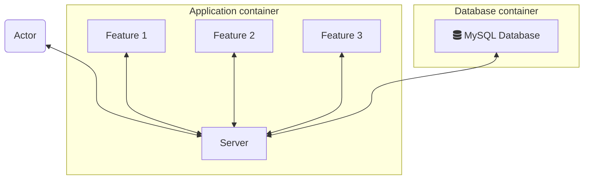

# Express.js boilerplate

A boilerplate for Express.js that can be used to develop your future apps in Node.js!

## Requirements

The application requires the following software installed on your machine. Other server versions should also work but the using the provided ones guarantees the application will start correctly.

- Node.js - `18.x.x`
- npm - `9.x.x`
- Docker - `20.x.x`
- Docker Compose - `2.15.x`

## Infrastructure components

- MySQL database - persistent application storage.
- Docker - used as runtime environment for application containers.

## Code components

- `Router` - it is responsible for persisting application paths and routing the traffic to the proper code component.
- `Handler` - a piece of code that is responsible for mapping input data to a format friendly for Controllers.
- `Controller` - a piece of code that keeps the business logic of the application.
- `Repository` - handles sending queries to MySQL database.

## Application diagram

The boilerplate application structure looks as presented on the diagram below:

## How to run

1. Pull the repository - `git clone git@github.com:elszczepano/expressjs-boilerplate.git && cd expressjs-boilerplate`.
2. Start the application - `docker-compose up --build`. If you run the application for the first time, containers will need to be pulled or built.
3. Visit `http://localhost:8000/hello` to confirm the application works correctly.

## How to run tests

1. Pull the repository - `git clone git@github.com:elszczepano/expressjs-boilerplate.git && cd expressjs-boilerplate`.
2. Install dependencies - `npm install`.
3. Run tests - `npm test`.

## Contribute

If you want to contribute do not hesitate to create an issue or a pull request!